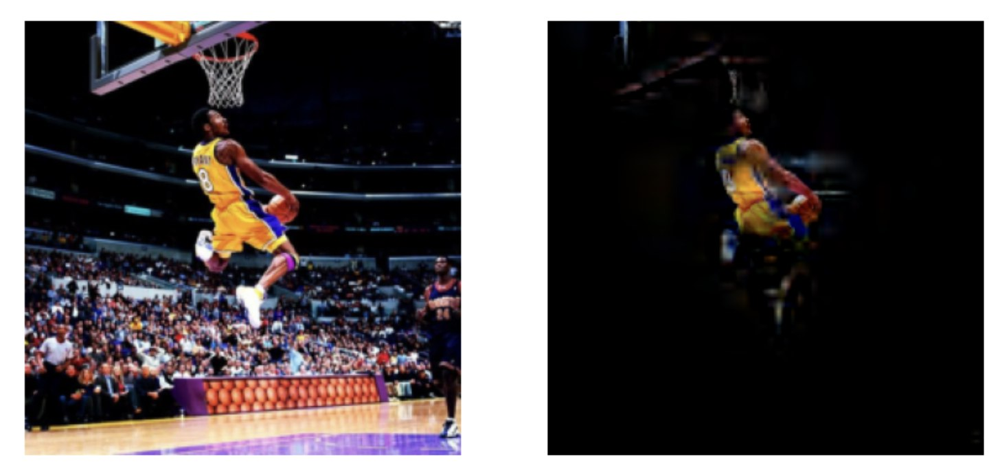

# About

This repository contains a python package for the saliency map method *CartoonX*, which is a core work from my  PhD work at LMU Munich. The initial method CartoonX method was first introduced in the ECCV 2022 paper [**Cartoon Explanations of Image Classifiers**](https://www.ecva.net/papers/eccv_2022/papers_ECCV/papers/136720439.pdf) and further improved in the CVPR 2023 paper [**Explaining Image Classifiers with Multiscale Directional Image Representation**](https://openaccess.thecvf.com/content/CVPR2023/papers/Kolek_Explaining_Image_Classifiers_With_Multiscale_Directional_Image_Representation_CVPR_2023_paper.pdf).

CartoonX was designed to extract the **relevant piece-wise smooth part** of an image. We leverage that piece-wise smooth images are sparse in the wavelet domain. In particular, we learn a sparsity-driven mask on the wavelet coefficients of the image to maximize a target class probability.



# Setup

# Content

# How to run

# Cite
If you use this code please cite

```bibtex
@inproceedings{kolek2022cartoon,
  title={Cartoon explanations of image classifiers},
  author={Kolek, Stefan and Nguyen, Duc Anh and Levie, Ron and Bruna, Joan and Kutyniok, Gitta},
  booktitle={European Conference on Computer Vision},
  pages={443--458},
  year={2022},
  organization={Springer}
}
```

```bibtex
@inproceedings{kolek2023explaining,
  title={Explaining image classifiers with multiscale directional image representation},
  author={Kolek, Stefan and Windesheim, Robert and Andrade-Loarca, Hector and Kutyniok, Gitta and Levie, Ron},
  booktitle={Proceedings of the IEEE/CVF Conference on Computer Vision and Pattern Recognition},
  pages={18600--18609},
  year={2023}
}
```

# License
<div>
<a rel="license" href="http://creativecommons.org/licenses/by-nc/4.0/"></a><br />This work is licensed under a <a rel="license" href="http://creativecommons.org/licenses/by-nc/4.0/">Creative Commons Attribution-NonCommercial 4.0 International License</a>.
</div>