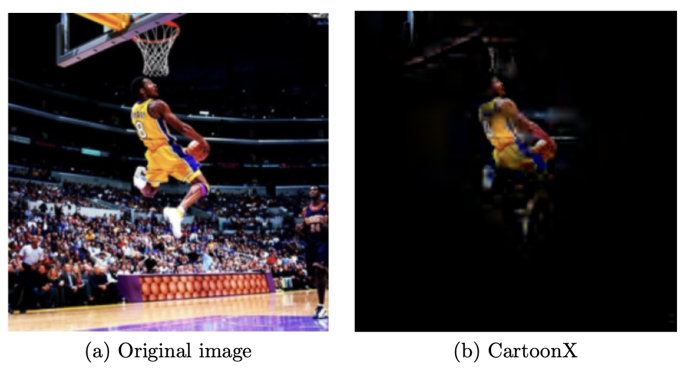

# CartoonX 🎨

<p align="center">
  
</p>

<p align="center">
  <a href="https://pypi.org/project/cartoonx/"></a>
  <a href="https://pypi.org/project/cartoonx/"></a>
  <a href="https://www.ecva.net/papers/eccv_2022/papers_ECCV/papers/136720439.pdf"></a>
  <a href="https://openaccess.thecvf.com/content/CVPR2023/papers/Kolek_Explaining_Image_Classifiers_With_Multiscale_Directional_Image_Representation_CVPR_2023_paper.pdf"></a>
  <a href="http://creativecommons.org/licenses/by-nc/4.0/"></a>
</p>

<p align="center">
  <b>Wavelet-domain saliency maps that reveal the piecewise-smooth structure a classifier responds to — not noisy pixel blobs.</b>
</p>

---

**CartoonX** is a model-agnostic explanation method for image classifiers. Rather than highlighting scattered pixels, it extracts the *relevant piecewise-smooth region* of an image by learning a sparsity-driven mask directly on **wavelet coefficients**. The result is a clean, interpretable "cartoon" explanation that shows exactly which smooth structures in the image drive the model's prediction.

Introduced at **ECCV 2022 (Oral)** and extended at **CVPR 2023** with multiscale directional representations (shearlets).

---

## ✨ Why CartoonX?

Most saliency methods highlight pixels. CartoonX highlights *structures*:

| Method | Domain | Output |
|---|---|---|
| GradCAM, Integrated Gradients | Pixel | Noisy gradient maps |
| LIME, SHAP | Superpixel | Blocky segment masks |
| **CartoonX** | **Wavelet** | **Clean piecewise-smooth explanations** |

Because natural images are approximately piecewise smooth (cartoon-like), enforcing sparsity in the wavelet domain is a much more natural inductive bias than pixel sparsity. CartoonX also avoids explanation *artifacts* — artificial edges that hallucinate features not present in the original image.

---

## 🚀 Installation

> **Prerequisite:** Install [PyTorch](https://pytorch.org/get-started/locally/) for your platform/CUDA version first.

```bash
pip install cartoonx
```

### Install from source

```bash
git clone https://github.com/skmda37/CartoonX.git
cd CartoonX
python -m venv venv && source venv/bin/activate
pip install -e ".[dev]"
```

---

## ⚡ Quick Start

```python
import torch
import torchvision.models as models
from cartoonx.pipeline.factory import create_cartoonx_explainer

# Load any image classifier
model = models.vgg16(pretrained=True).eval()

# Create the CartoonX explainer
explainer = create_cartoonx_explainer(model)

# Your image: (1, 3, H, W) tensor, normalised
image = ...  # torch.Tensor

# Run CartoonX — returns the wavelet mask and masked image
mask, explanation = explainer.explain(image, target_class=243)
```

For a full walkthrough including visualisation, see [`notebooks/example.ipynb`](notebooks/example.ipynb).

---

## 🔬 How It Works

CartoonX is built on the **Rate-Distortion Explanation (RDE)** framework. The core idea:

1. Natural images are approximately piecewise smooth → they are **sparse in the wavelet domain**.
2. CartoonX optimises a binary/soft mask **on wavelet coefficients** to maximise the target class probability while keeping the mask sparse.
3. Inverting the masked coefficients back to image space gives a clean, smooth explanation.

An optional **spatial energy penalty** can additionally black out regions that carry no useful information, sharpening the localisation.

In the CVPR 2023 extension, wavelets are replaced by **shearlets** — a directional multiscale system that captures oriented edges more faithfully, further reducing hallucinated artifacts.

---

## 📁 Repository Structure

```
src/
└── cartoonx/
    ├── modelling/
    │   └── explainer.py      # Core CartoonX optimisation loop
    ├── pipeline/
    │   └── factory.py        # Explainer factory / configuration
    └── utils/
        └── torchutils.py     # PyTorch helper utilities
notebooks/
└── example.ipynb             # End-to-end example with visualisation
tests/                        # Unit tests
```

---

## 📄 Papers

This package implements the methods described in:

**CartoonX (ECCV 2022 — Oral)**
> Kolek, S., Nguyen, D. A., Levie, R., Bruna, J., & Kutyniok, G. (2022). *Cartoon Explanations of Image Classifiers.* European Conference on Computer Vision. [[PDF]](https://www.ecva.net/papers/eccv_2022/papers_ECCV/papers/136720439.pdf)

**ShearletX / WaveletX (CVPR 2023)**
> Kolek, S., Windesheim, R., Andrade-Loarca, H., Kutyniok, G., & Levie, R. (2023). *Explaining Image Classifiers with Multiscale Directional Image Representation.* CVPR. [[PDF]](https://openaccess.thecvf.com/content/CVPR2023/papers/Kolek_Explaining_Image_Classifiers_With_Multiscale_Directional_Image_Representation_CVPR_2023_paper.pdf)

---

## 📝 Citation

If you use CartoonX in your research, please cite:

```bibtex
@inproceedings{kolek2022cartoon,
  title     = {Cartoon explanations of image classifiers},
  author    = {Kolek, Stefan and Nguyen, Duc Anh and Levie, Ron and Bruna, Joan and Kutyniok, Gitta},
  booktitle = {European Conference on Computer Vision},
  pages     = {443--458},
  year      = {2022},
  organization = {Springer}
}

@inproceedings{kolek2023explaining,
  title     = {Explaining image classifiers with multiscale directional image representation},
  author    = {Kolek, Stefan and Windesheim, Robert and Andrade-Loarca, Hector and Kutyniok, Gitta and Levie, Ron},
  booktitle = {Proceedings of the IEEE/CVF Conference on Computer Vision and Pattern Recognition},
  pages     = {18600--18609},
  year      = {2023}
}
```

---

## 🤝 Contributing

Bug reports, feature requests, and pull requests are very welcome! Please open an [issue](https://github.com/skmda37/CartoonX/issues) first to discuss larger changes.

```bash
pip install -e ".[dev]"
pytest tests/
```

---

## 📜 License

This work is licensed under a [Creative Commons Attribution-NonCommercial 4.0 International License](http://creativecommons.org/licenses/by-nc/4.0/).