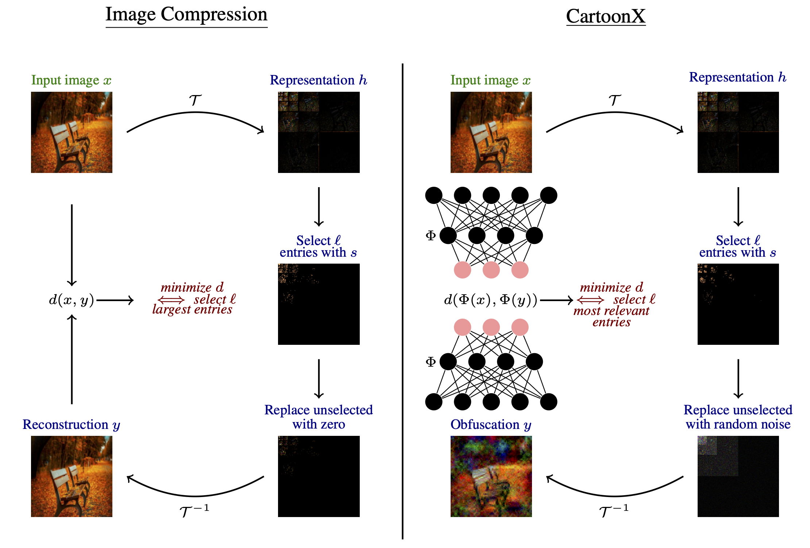

<div align="center">
	<a href = "https://www.ecva.net/papers/eccv_2022/papers_ECCV/papers/136720439.pdf">
        Paper Title: Cartoon Explanation of Image Classifiers

		
<div><p>Authors: Stefan Kolek, Duc Anh Nguyen, Ron Levie, Joan Bruna, Gitta Kutyniok<br>Conference: ECCV 2022 (Oral)</p></div>

</div>
    

# Paper Contributions
CartoonX (Cartoon Explanation) is a novel model-agnostic explanation method tailored towards image classifiers and based
on the rate-distortion explanation (RDE) framework. Natural images are roughly piece-wise smooth signals—also called cartoon-like images and tend to be sparse in the wavelet domain. CartoonX is the first explanation method to exploit this by requiring its explanations to be sparse in the wavelet domain, thus extracting the relevant piece-wise smooth part of an image instead of relevant pixel-sparse regions.


# Setup
Python 3.7.x and newer are supported:

```bash
# clone project   
git clone https://github.com/skmda37/CartoonX.git 

# Enter directocry
cd CartoonX 

# Create and activate virtual environment (or conda environment)
python -m venv env
source env/bin/activate   

# install pytorch wavelets package (see https://pytorch-wavelets.readthedocs.io/en/latest/readme.html for the docs)
git clone https://github.com/fbcotter/pytorch_wavelets
cd pytorch_wavelets
pip install .
pip install -r tests/requirements.txt
pytest tests/
cd ..

# install other project dependencies from requirements file   
pip install -r requirements.txt
```   
    
    
# Contents
There are two folders:
<ol>
<li>The <code><a href = "./code/">code/</a></code> folder contains the code to use CartoonX.</li>
<li>The <code><a href = "./imgs/">imgs/</a></code> folder contains all images for this README.md.</li>
</ol>


# How to Run?
<div>
First, do <code>cd <a href = "./code/">code/</a></code>. Then you can explain models with CartoonX in <code><a href = "./code/visualize_example_explanations.ipynb">visualize_example_explanations.ipynb</a></code>. The actual code for CartoonX is in  <code><a href = "./code/cartoonx.py">./code/cartoonx.py</a></code>.


# Cite
```bibtex
@inproceedings{kolek2023explaining,
  title={Cartoon Explanations of Image Classifiers},
  author={Kolek, Stefan and Nguyen, Duc Anh and Levie, Ron and Bruna, Joan and Kutyniok, Gitta},
  booktitle={European Conference of Computer Vision (ECCV)},
  year={2022}
}

```
# License
<div>
<a rel="license" href="http://creativecommons.org/licenses/by-nc/4.0/"></a><br />This work is licensed under a <a rel="license" href="http://creativecommons.org/licenses/by-nc/4.0/">Creative Commons Attribution-NonCommercial 4.0 International License</a>.
</div>
