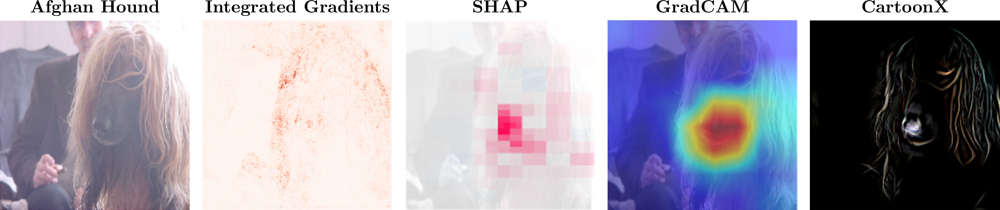
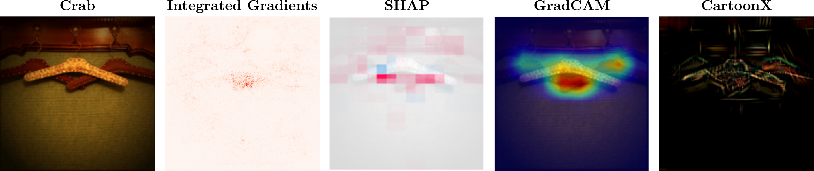
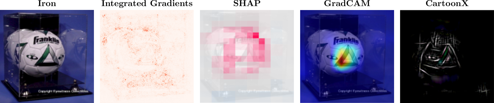
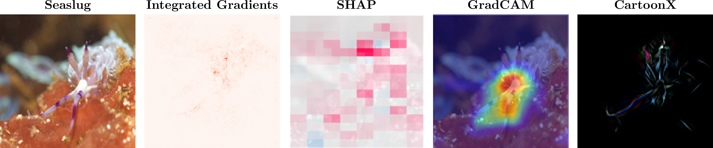
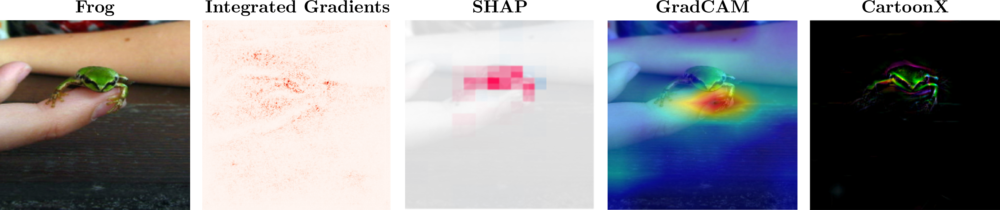

# CartoonX

<p align="center">
  
</p>
<p align="center">
  <a href="https://github.com/skmda37/bigfile"></a>
  <a href="https://pytorch.org/"></a>
  <a href="https://openaccess.thecvf.com/content/CVPR2023/papers/Kolek_Explaining_Image_Classifiers_With_Multiscale_Directional_Image_Representation_CVPR_2023_paper.pdf"></a>
  <a href="https://opensource.org/licenses/MIT"></a>
</p>

---


**CartoonX** is a saliency map method for image classifiers operating in the wavelet/shearlet domain. It extracts the relevant piecewise-smooth (cartoon-like) part of an image by optimizing a sparsity-driven deletion mask on wavelet/shearlet coefficients. Unlike previous methods CartoonX can highlight fine image structures such as edges and textures that drive the model’s prediction.


---

## Why CartoonX?

| Method | Domain | Explanation |
|---|---|---|
| Integrated Gradients, LRP | Pixel | Noisy |
| SHAP, LIME | Pixel | Blocky/Segmented |
| GradCAM | Pixel | Smooth |
| **CartoonX** | **Wavelet/Shearlet** | **Piecewise-Smooth** |

Most saliency methods highlight individual pixels (e.g. Integrated Gradients, LRP), blocky superpixels (e.g. SHAP, LIME) or very smooth windows of pixels (e.g. GradCAM). **CartoonX** highlights piece-wise smooth image *structures*, allowing it to separate classifier-relevant edges and textures that other methods miss. 

CartoonX is an excellent tool to visually understand predictions that are driven by low-level structures. For instance in the first two examples below a classifier confused a hanger and a soccer ball with a crab and an iron respectively. CartoonX helps us understand how the classifier may have seen an iron in the ball and a crab in the hanger.

<p align="center">
  
</p>


<p align="center">
  
</p>

<p align="center">
  
</p>

<p align="center">
  
</p>

---

## Installation
If you don't have one yet, make a python virtual environment using `python>=3.9`.

```bash
uv venv --python 3.XX
```

Activate your environment.

```bash
source .venv/bin/activate
```

Install [PyTorch](https://pytorch.org/get-started/locally/) for your platform/CUDA version first. Then install our package with pip.

```bash
uv pip install --index-url https://test.pypi.org/simple/ --extra-index-url https://pypi.org/simple/ cartoonx
```

---

## Quick Start

```python
import torch
import torchvision.models as models
from cartoonx import CartoonXFactory

# Load any image classifier
model = models.vgg16(pretrained=True).eval().to('cuda:0')

# Create the CartoonX explainer 
cartoon = CartoonXFactory.create(system='wavelets', device=device)

# Your image: (1, 3, H, W) tensor, normalized
image = ...  # torch.Tensor

# Optimizes wavelet mask to maximize target class
# Returns: explanation image and wavelet/shearlet mask
explanation = cartoon.explain(model, x, y)
```

For a full walkthrough example including visualisation, see [`examples/mobilenetv3.py`](examples/mobilenetv3.py). You can run it via

```bash
cd ./examples
python mobilenetv3.py
```


---

## Repository Structure

```
src/
└── cartoonx/
    ├── modelling/
    │   └── explainer.py      # Core CartoonX optimization loop
    ├── pipeline/
    │   └── factory.py        # Explainer factory / configuration
    └── utils/
        └── torchutils.py     # PyTorch helper utilities
notebooks/
└── example.ipynb             # End-to-end example with visualisation
tests/                        # Unit tests
```

---

## How It Works

CartoonX is a mask-based explanation method, i.e., the explanation is generated by optimizing a deletion mask. While previous mask approaches optimized a mask in pixel space, CartoonX does so in wavelet/shearlet space. CartoonX leverages that piecewise smooth signals (such as natural images) are **sparse in the wavelet/shearlet domain**. CartoonX optimizes a binary/soft deletion **mask on wavelet/shearlet coefficients** to maximise the target class probability. A **mask penalty** enforces and controls the piece-wise smoothness of the explanation. A **spatial energy penalty** controls how much spatial energy in the image is deleted. **Inverting the masked coefficients** back to image space gives a clean, piece-wise smooth explanation.
Using classical wavelet/shearlet theory, we can show that **masking in the wavelet/shearlet domain does not create artificial edges** or high-frequency artifacts in the explanation.

---


## Papers

CartoonX was first introduced as a mask explanation method in the wavelet domain in:

> Kolek, S., Nguyen, D. A., Levie, R., Bruna, J., & Kutyniok, G. (2022). *Cartoon Explanations of Image Classifiers.* European Conference on Computer Vision. [[PDF]](https://www.ecva.net/papers/eccv_2022/papers_ECCV/papers/136720439.pdf)


Later, we improved and extended CartoonX, adding a spatial energy penalty, replacing wavelets with shearlets, and adding a theoretical analysis of explanation artifacts:

> Kolek, S., Windesheim, R., Andrade-Loarca, H., Kutyniok, G., & Levie, R. (2023). *Explaining Image Classifiers with Multiscale Directional Image Representation.* CVPR. [[PDF]](https://openaccess.thecvf.com/content/CVPR2023/papers/Kolek_Explaining_Image_Classifiers_With_Multiscale_Directional_Image_Representation_CVPR_2023_paper.pdf)

---

## Note
Shearlet-based CartoonX (from the CVPR 2023 paper) is not yet available in this package due to an upstream issue with [PyShearLab](https://github.com/rafael-g-depaulo/pyshearlab). Wavelet-based CartoonX is fully functional. Shearlet support will be added once the upstream issue is resolved.


---

## Citation

If you use CartoonX in your research, please cite:

```bibtex
@inproceedings{kolek2022cartoon,
  title     = {Cartoon explanations of image classifiers},
  author    = {Kolek, Stefan and Nguyen, Duc Anh and Levie, Ron and Bruna, Joan and Kutyniok, Gitta},
  booktitle = {European Conference on Computer Vision},
  pages     = {443--458},
  year      = {2022},
  organization = {Springer}
}

@inproceedings{kolek2023explaining,
  title     = {Explaining image classifiers with multiscale directional image representation},
  author    = {Kolek, Stefan and Windesheim, Robert and Andrade-Loarca, Hector and Kutyniok, Gitta and Levie, Ron},
  booktitle = {Proceedings of the IEEE/CVF Conference on Computer Vision and Pattern Recognition},
  pages     = {18600--18609},
  year      = {2023}
}
```


---

## License

This project is licensed under the [MIT License](LICENSE).