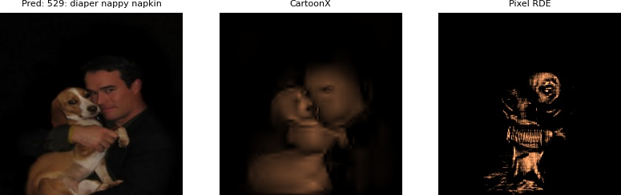
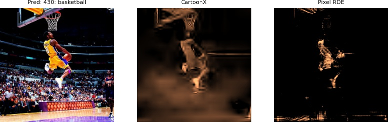

# CartoonX: Cartoon Explanations of Image Classifiers  





## Description   
This repository provides an implementation of CartoonX, an explanation method for image classifiers that we introduce in our preprint paper [Cartoon Explanation of Image Classifiers](https://arxiv.org/abs/2110.03485). CartoonX extracts the relevant piece-wise smooth part of an image and provides cartoon-like explanations. We provide a package with an implementation of CartoonX and a Jupyter notebook demonstrating its usage with examples.

## How to run   
First, install all dependencies:   
```bash
# clone project   
git clone https://github.com/skmda37/CartoonX.git 

# Enter directory
cd CartoonX 

# Create and activate virtual environment (or conda environment)
python -m venv env
source env/bin/activate   

# install pytorch wavelets package (see https://pytorch-wavelets.readthedocs.io/en/latest/readme.html for the docs)
git clone https://github.com/fbcotter/pytorch_wavelets
cd pytorch_wavelets
pip install .
pip install -r tests/requirements.txt
pytest tests/
cd ..

# install other project dependencies from requirements file   
pip install -r requirements.txt
 ```   
 Pick a path to a folder of image files that you would like to classify and explain. We have some images for example in `examples/imgdir`. Next run the script as follows: 
 ```bash
# module folder
python project/main.py --imgdir=examples/imgdir --logdir=logdir --resize_images
```
`imgdir` is a path to a directory containing image files that are to be explained. `logdir` is a directory where the CartoonX explanations (and Pixel RDEs for comparison) are logged to. If you pass `--tensorboard` then the explanations are logged to tensorboard where they can easily be visualized (on localhost:6006) by running `tensorboard --logdir=logdir --port=6006`. Passing `--resize_images` resizes all images in `imgdir` to 256x256 pixels before the classification and explanation. 
## Imports
This project is setup as a package, which means you can now easily import CartoonX like so:
```python
from project.cartoonX import CartoonX
import matplotlib.pyplot as plt
import numpy as np
import torch
import torch.nn as nn

# get device
device = torch.device("cuda:0" if torch.cuda.is_available() else "cpu")                      

# assumes getmodel() returns pytorch classifier with pre-softmax output
model = getmodel().eval().to(device)

# assumes get_datapoint returns image tensor of shape (1,C,W,H)
x = get_datapoint().to(device)

# classifiy image
outputs = model(x)
pred = nn.Softmax(dim=1)(output).max(1)[1].item() 

# get CartoonX - HPARAMS is a dictionary defining all the hyperparams
cartoonX = CartoonX(model=model, device=device, **HPARAMS)
explanation = cartoonX(x, pred)

# plot explanation
fig, axs = plt.subplots(1,2)
axs[0].imshow(np.asarray(transforms.ToPILImage()(x.squeeze(0))),
              vmin=0, vmax=255)
axs[0].axis("off")
axs[1].imshow(np.asarray(transforms.ToPILImage()(explanation.squeeze(0))),
              vmin=0, vmax=255, cmap="copper")
axs[1].axis("off")

plt.show()
```

### Citation   
```
@article{kolek2021cartoon,
  title={Cartoon Explanations of Image Classifiers},
  author={Stefan Kolek, Duc Anh Nguyen, Ron Levie, Joan Bruna, and Gitta Kutyniok},
  eprint={2110.03485},
  archivePrefix={arXiv},
  year={2021}
}
```   
